# 📬 ContactHub Admin Platform


Enterprise-grade communication management platform designed for enquiry processing, subscription management, response workflows, email delivery monitoring, and administrative communication operations.

---

<p align="center">
  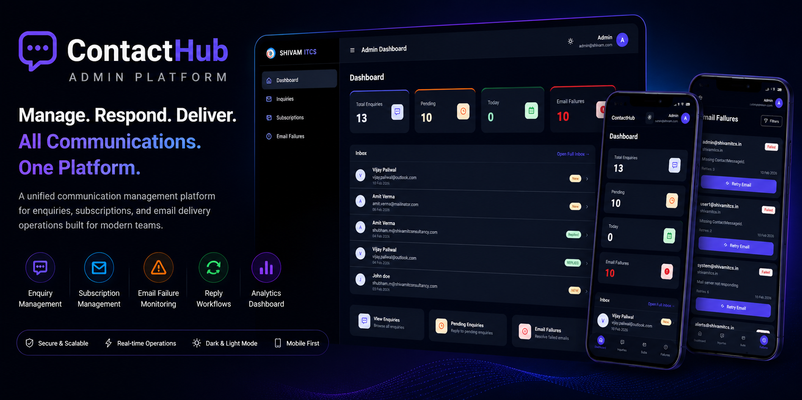
</p>

---

## Platform Vision

ContactHub is a modern communication operations platform engineered for organizations that manage customer enquiries, subscriptions, communication workflows, and email delivery operations across multiple digital properties.

The platform centralizes communication management into a single administrative environment where teams can review enquiries, respond to customers, monitor delivery failures, manage subscriptions, and maintain operational visibility through an intuitive mobile-first experience.

Designed with an enterprise product mindset, ContactHub focuses on operational efficiency, communication transparency, scalable workflows, and modern administrative experiences.

---

## Platform Highlights

- Unified communication management platform
- Centralized enquiry operations
- Subscription management workflows
- Email delivery monitoring infrastructure
- Mobile-first administrative experience
- Dark and light theme support
- Workflow-driven communication operations
- Operational dashboard analytics
- Enterprise-ready architecture
- Responsive user experience

---

# 👥 Communication Management Ecosystem

The platform provides a centralized operational environment for managing customer interactions, communication workflows, subscription requests, and delivery operations.

---

## 📩 Enquiry Management

Administrators can:

- review incoming enquiries
- inspect enquiry details
- respond directly to customers
- manage enquiry status
- filter communication records
- monitor operational activity

The enquiry infrastructure is designed to streamline customer communication workflows and reduce response times.

---

## 📬 Subscription Management

Subscription workflows include:

- subscriber monitoring
- subscription tracking
- communication actions
- domain visibility
- operational filtering
- administrative management

The system enables organizations to manage subscriber activity from a unified interface.

---

## ⚠️ Email Failure Monitoring

The platform includes operational monitoring for email delivery issues.

Capabilities include:

- failed email tracking
- retry workflows
- operational diagnostics
- delivery visibility
- monitoring dashboards
- communication recovery actions

---

## Multi-Domain Communication Architecture

- domain-level communication management
- centralized operational visibility
- scalable communication workflows
- administrative control layer
- communication lifecycle monitoring
- workflow-driven operations

---

## Enterprise Features

- Responsive administrative dashboards
- Communication workflow management
- Operational analytics infrastructure
- Mobile-first design system
- Dark and light mode support
- Administrative action workflows
- Enterprise communication visibility
- Scalable operational architecture
- High-performance user experience
- Modern management interface

---

## Technology Stack

### Frontend Engineering

- Angular 19
- Ionic Framework
- TypeScript
- SCSS
- Angular Router
- RxJS
- Responsive UI Architecture

---

### Backend Infrastructure

- Firebase
- Firestore Database
- Firebase Authentication
- Cloud Functions
- Firebase Hosting
- REST-based Services

---

### Communication Infrastructure

- Contact Processing
- Subscription Management
- Email Delivery Workflows
- Response Management
- Communication Monitoring
- Administrative Operations

---

### Architecture & Operations

- Mobile-First Architecture
- Component-Based Design
- Operational Dashboard System
- Workflow Infrastructure
- Responsive Engineering
- Theme Management

---

# 🏗️ System Architecture

The ContactHub Admin Platform follows a modular communication management architecture designed for enquiry processing, subscription management, email delivery monitoring, and administrative operations.

<p align="center">
  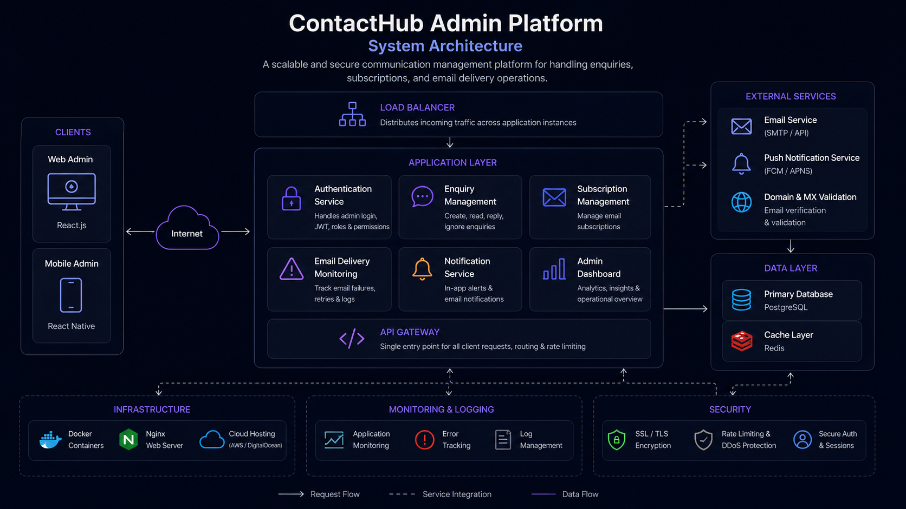
</p>

### Architecture Highlights

- Secure Authentication & Access Control
- Enquiry Management Workflows
- Subscription Management Operations
- Email Delivery Monitoring & Retry System
- Notification & Alert Services
- Centralized Administrative Dashboard
- Database & Cache Layer Integration
- Monitoring, Logging & Security Controls
- Scalable Cloud Deployment Infrastructure

---

## Platform Preview

Modern communication workflows engineered for administrators, support teams, customer operations, and communication management systems.

The platform delivers centralized communication infrastructure through enquiry workflows, subscription management systems, delivery monitoring operations, and enterprise-grade administrative experiences.

---

# 🌐 Web Platform Screenshots

<p align="center">
  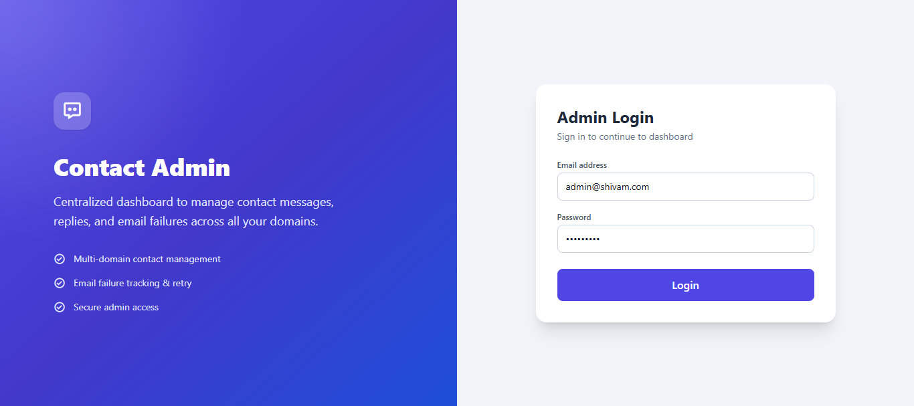
  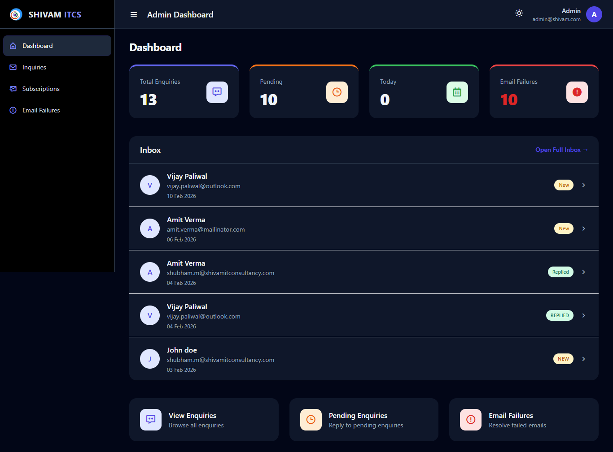
</p>

<p align="center">
  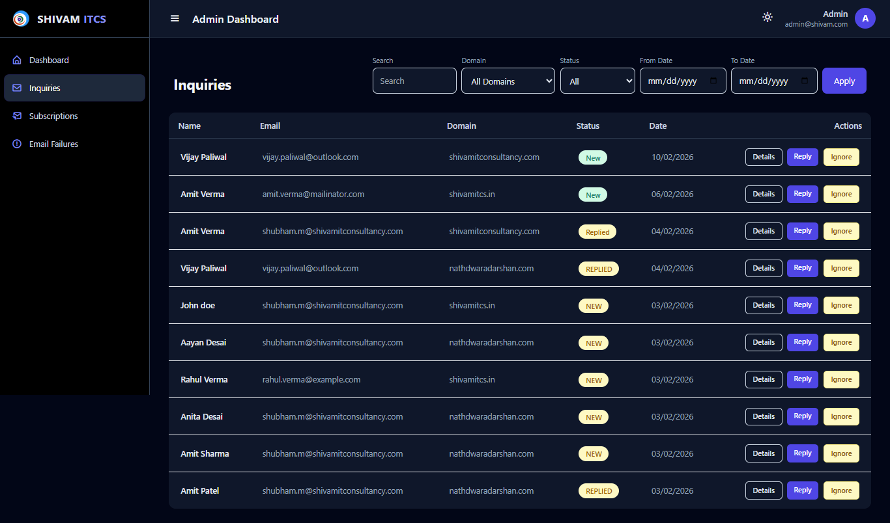
  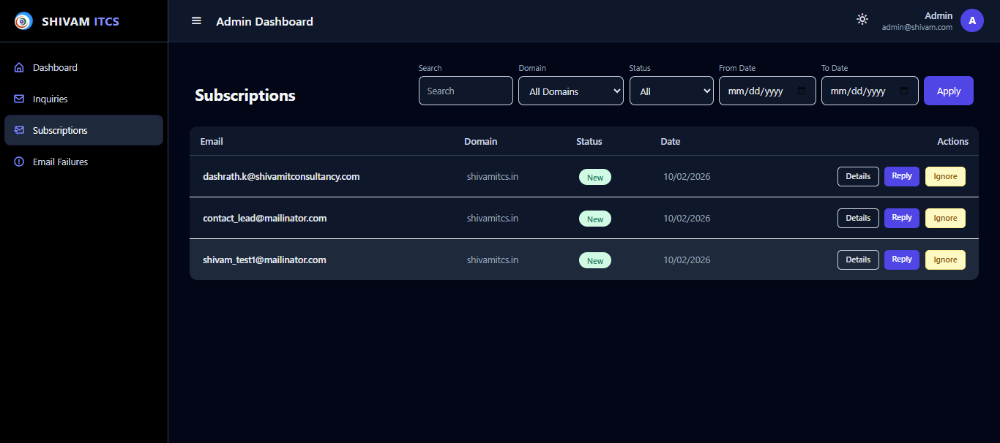
</p>

<p align="center">
  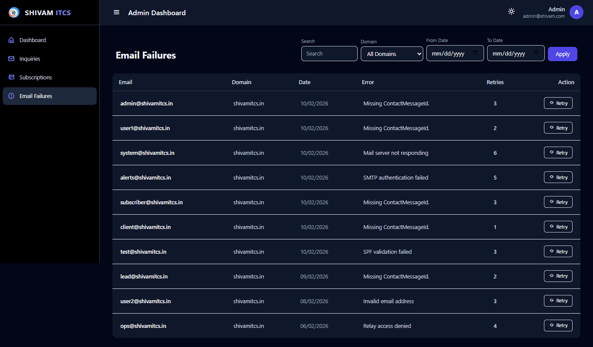
  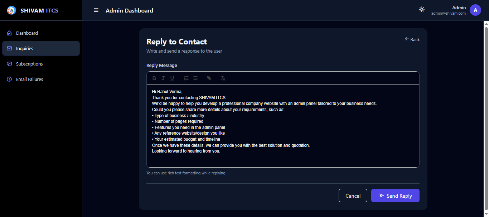
</p>

---

# 📱 Mobile Platform Screenshots

<p align="center">
  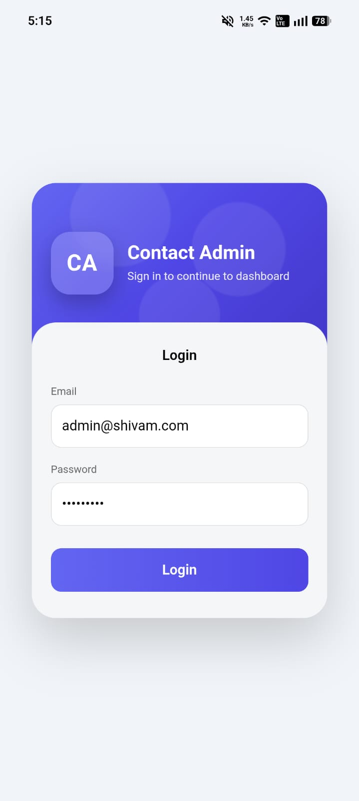
  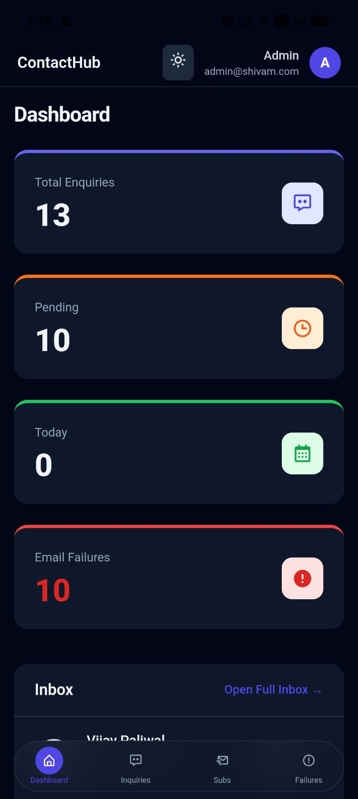
  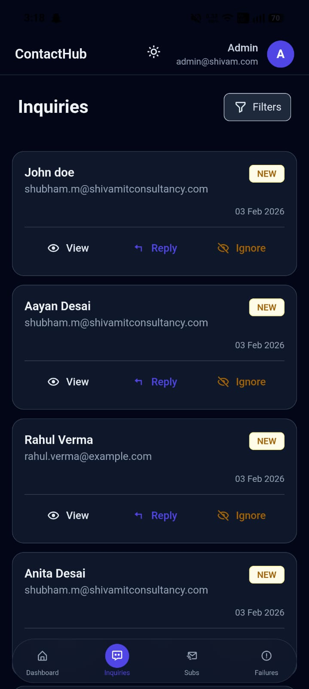
</p>

<p align="center">
  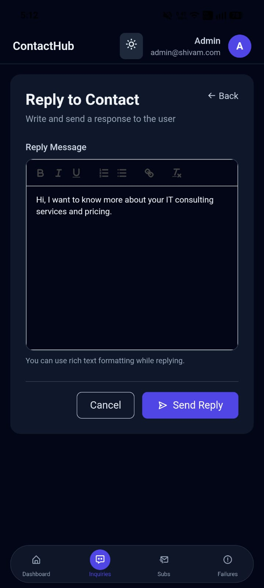
  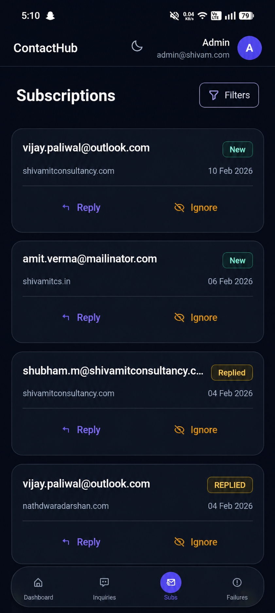
  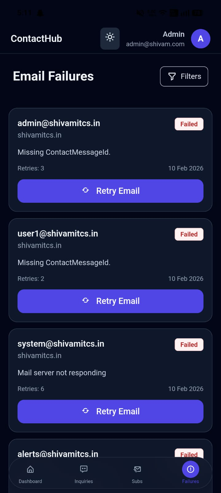
</p>

---

## 🔐 Security Architecture

Communication platforms require secure administrative workflows and protected operational infrastructure.

ContactHub includes:

* protected administrative access
* authentication-based workflows
* communication management controls
* operational action security
* protected administrative interfaces
* secure communication operations

---

## ⚡ Scalability Engineering

The platform is engineered for scalable communication operations across multiple organizations, projects, and domains.

### Scalability Features

* modular architecture
* scalable communication workflows
* responsive operational systems
* centralized management infrastructure
* reusable UI architecture
* enterprise deployment readiness

---

## Business Problem

Organizations frequently struggle with:

- fragmented communication systems
- disconnected enquiry workflows
- inefficient response management
- poor operational visibility
- manual subscription handling
- limited delivery monitoring
- inconsistent administrative experiences

Modern organizations require centralized communication infrastructure capable of managing enquiries, subscriptions, customer interactions, and operational workflows through one unified platform.

---

## Solution

ContactHub was developed to centralize communication operations into a scalable administrative ecosystem.

The platform enables:

- centralized enquiry management
- subscription administration
- communication monitoring
- response workflows
- operational visibility
- delivery failure management
- scalable communication operations
- enterprise administrative workflows

The ecosystem is designed to modernize communication management through workflow-driven operations and responsive administrative experiences.

---

## Platform Focus Areas

- Communication Management
- Contact Operations
- Subscription Infrastructure
- Email Monitoring
- Workflow Automation
- Administrative Platforms
- Mobile Administration
- Enterprise Communication Systems

---

## Product Roadmap

### Phase 1 — Communication Foundation

- enquiry management
- subscription workflows
- dashboard analytics
- delivery monitoring
- administrative operations

---

### Phase 2 — Workflow Automation

- automated responses
- workflow enhancements
- operational automation
- communication optimization
- action orchestration

---

### Phase 3 — Enterprise Scaling

- advanced analytics
- multi-organization workflows
- operational intelligence
- scalable management infrastructure
- reporting systems

---

### Phase 4 — Intelligent Operations

- predictive workflows
- AI-assisted communication support
- intelligent operational monitoring
- advanced workflow automation
- future-ready management systems

---

## Deployment Infrastructure

- cloud deployment support
- production-ready architecture
- scalable communication infrastructure
- operational monitoring
- environment-based configuration
- enterprise deployment readiness

---

## Repository Structure

```txt
assets/
├── architecture/
├── branding/
├── screenshots/
│   ├── mobile/
│   └── web/
└── workflows/
```

---

# Engineering Vision

ContactHub represents a future-ready communication operations platform engineered for scalable customer interactions, centralized communication workflows, operational visibility, and enterprise-grade administrative experiences.

Designed with a product-engineering mindset, the platform focuses on communication efficiency, operational scalability, workflow optimization, and modern administrative infrastructure.

---

# Why This Platform Exists

Modern communication operations are often fragmented across multiple tools and disconnected workflows.

ContactHub was designed to unify enquiry management, subscription operations, delivery monitoring, and communication workflows into one centralized administrative platform.

The goal is to simplify communication management through scalable operational systems and modern administrative experiences.

---

# 📄 License

MIT License

Copyright © 2026 SHIVAM ITCS
